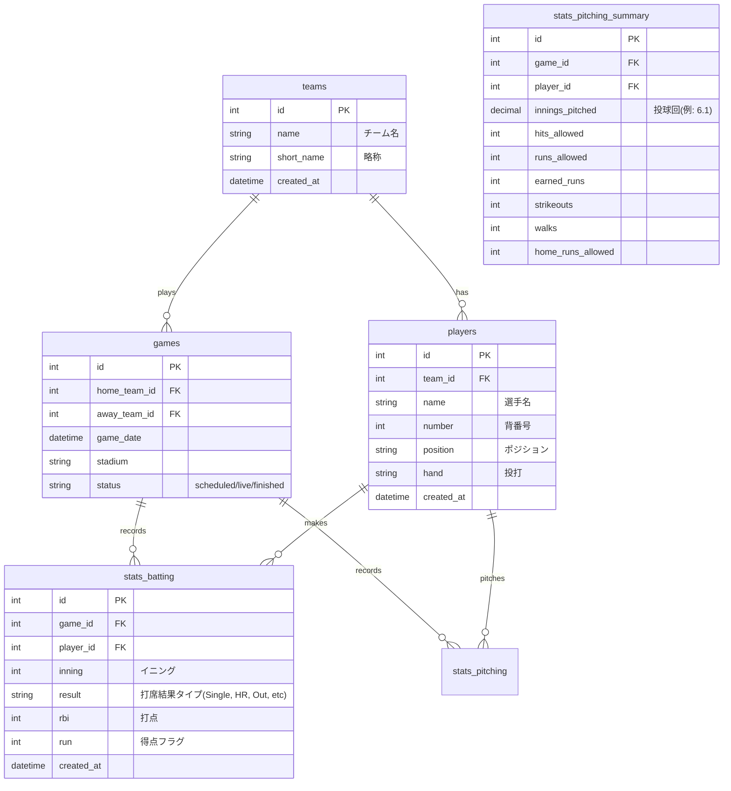

# データベース設計書

## 1. ER図概要



## 2. テーブル定義詳細

### 2.1 teams (チーム)

| カラム名   | 型          | 説明               |
| ---------- | ----------- | ------------------ |
| id         | INT         | PK, AUTO_INCREMENT |
| name       | VARCHAR(50) | チーム名           |
| short_name | VARCHAR(10) | 略称               |

### 2.2 players (選手)

| カラム名 | 型          | 説明               |
| -------- | ----------- | ------------------ |
| id       | INT         | PK, AUTO_INCREMENT |
| team_id  | INT         | FK -> teams.id     |
| name     | VARCHAR(50) | 選手名             |
| number   | INT         | 背番号             |
| position | VARCHAR(10) | 守備位置           |

### 2.3 games (試合)

| カラム名     | 型          | 説明               |
| ------------ | ----------- | ------------------ |
| id           | INT         | PK, AUTO_INCREMENT |
| home_team_id | INT         | FK                 |
| away_team_id | INT         | FK                 |
| game_date    | DATETIME    | 試合日時           |
| status       | VARCHAR(20) | 試合ステータス     |

### 2.4 at_bats (打席結果・ログ)

打席ごとのイベントを記録するテーブル。ここから打率などを集計する。
| カラム名 | 型 | 説明 |
| --- | --- | --- |
| id | INT | PK, AUTO_INCREMENT |
| game_id | INT | FK |
| batter_id | INT | FK -> players.id (打者) |
| pitcher_id | INT | FK -> players.id (投手) |
| inning | INT | イニング |
| result_type | ENUM | 'Single', 'Double', 'Triple', 'HR', 'Walk', 'HBP', 'Strikeout', 'Groundout', 'Flyout', 'Sacrifice', 'Error' |
| rbi | INT | 打点 |
| is_sac_fly | BOOLEAN | 犠飛かどうか(打数計算用) |

### 2.5 pitching_logs (投手成績・サマリー)

投手は1球ごとの記録よりも、試合またはイニングごとの集計値を保存・更新する運用とする（自責点などは判定が必要なため）。
| カラム名 | 型 | 説明 |
| --- | --- | --- |
| id | INT | PK, AUTO_INCREMENT |
| game_id | INT | FK |
| pitcher_id | INT | FK |
| innings_pitched | FLOAT | 投球回 (整数部+0.1, 0.2で表現) |
| batter_faced | INT | 対戦打者数 |
| hits | INT | 被安打 |
| homerun | INT | 被本塁打 |
| walk | INT | 与四球 |
| strikeout | INT | 奪三振 |
| runs | INT | 失点 |
| earned_runs | INT | 自責点 |

## 3. 計算ロジック

API側で以下のSQL等を用いて集計する。

### 打率 (AVG)

```sql
SUM(CASE WHEN result_type IN ('Single', 'Double', 'Triple', 'HR') THEN 1 ELSE 0 END) /
SUM(CASE WHEN result_type NOT IN ('Walk', 'HBP', 'Sacrifice', 'Error') OR (result_type = 'Sacrifice' AND is_sac_fly = 0) THEN 1 ELSE 0 END)
```

※厳密な打数定義に基づいて計算

### 防御率 (ERA)

```sql
(SUM(earned_runs) * 9) / SUM(innings_pitched_converted)
```

※投球回の0.1, 0.2はそれぞれ1/3, 2/3として計算
